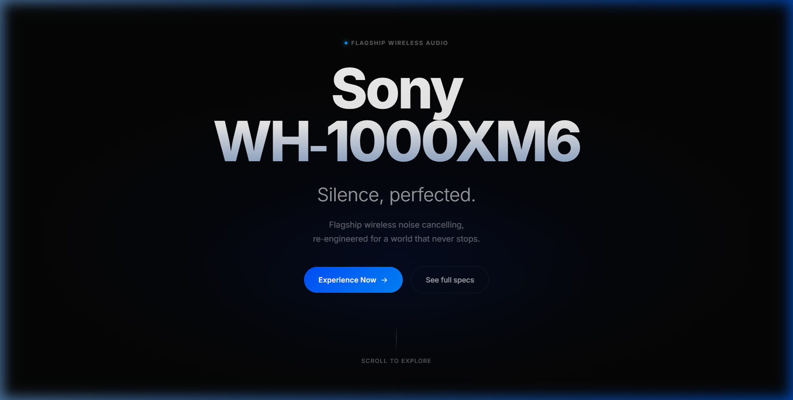
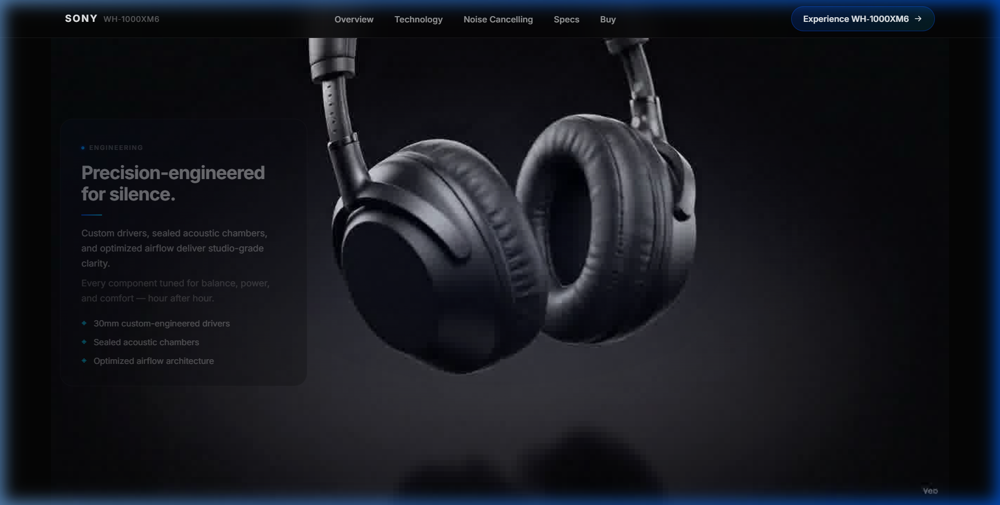
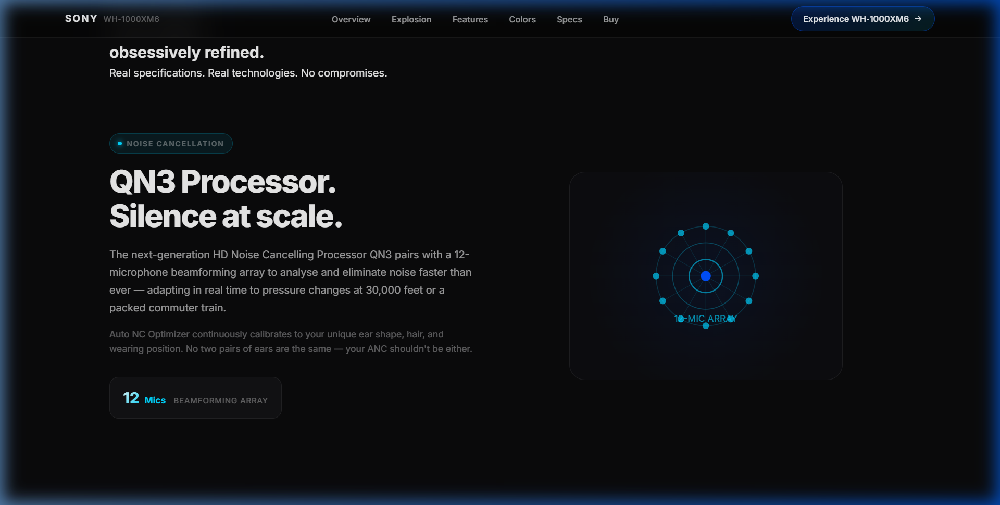
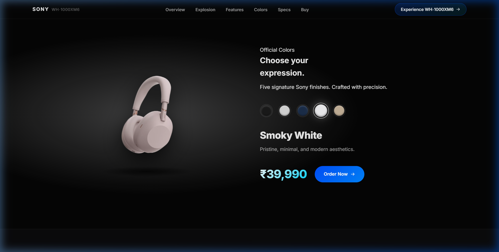
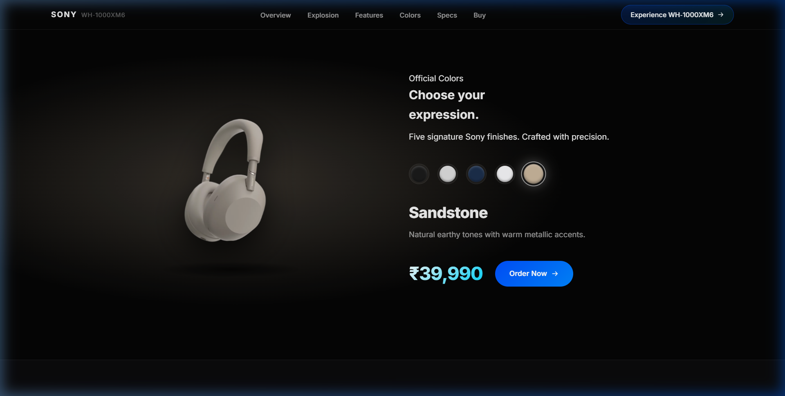
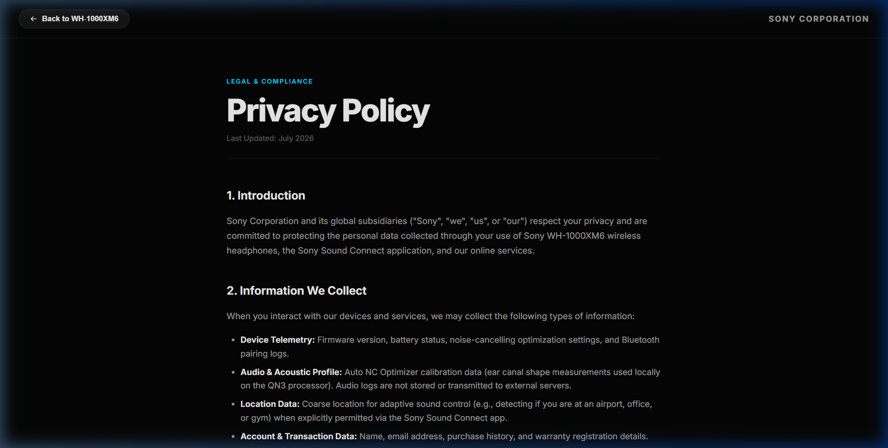
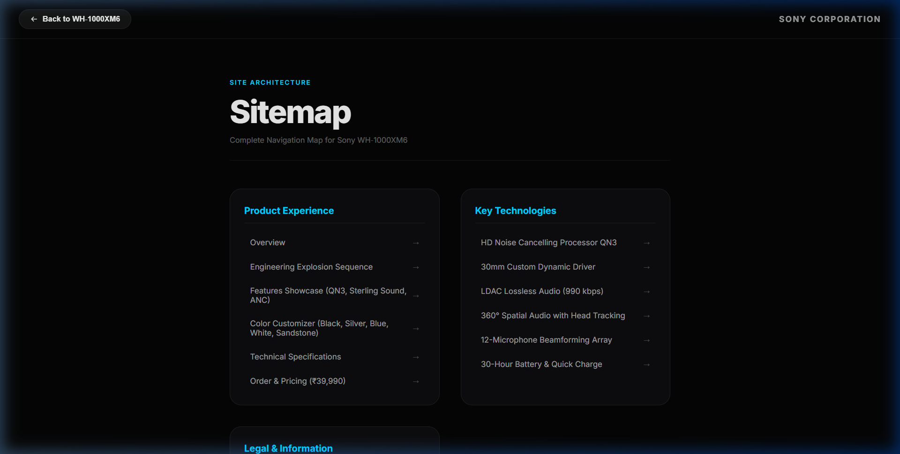

# Sony WH-1000XM6 — Cinematic Scrollytelling Web Experience

### Viw: [3dsoney.vercel.app/](https://3dsoney.vercel.app/)



> **Awwwards-Level Product Reveal & Interactive Engineering Showcase**  
> An ultra-premium, Apple-level 3D scrollytelling web experience built for the flagship **Sony WH-1000XM6** wireless noise-cancelling headphones. Driven by a high-performance 240-frame 60FPS canvas animation engine, real-time scroll interpolation, official Sony Scene7 assets, and responsive interactive components.

---

## 🌟 Key Highlights

- 🎧 **240-Frame Interactive Explosion Sequence**: Seamless disassembly and reassembly of headphone internal components synchronized to scroll progress.
- ⚡ **60 FPS Canvas Lerp Engine**: Decoupled `requestAnimationFrame` loop with linear interpolation (`LERP_FACTOR = 0.14`) for buttery-smooth scroll catch-up.
- 🎨 **Official Color Customizer**: Real-time 5-color switcher using official Sony Scene7 transparent PNG assets (*Midnight Black, Platinum Silver, Midnight Blue, Smoky White, Sandstone*).
- 📊 **Dynamic Scroll-Linked Feature Visuals**:
  - **QN3 Processor**: 12-microphone beamforming array activating dot by dot on scroll.
  - **Sterling Sound Tuning**: Dynamic equalizer audio bars animating in response to scroll.
  - **Aware of You**: 360° Spatial Audio head tracking orbit rotating on scroll.
  - **30-Hour Battery**: Live charging animation filling up from 0% to 100% (0h to 30h) as you scroll past.
- 📜 **Full Dedicated Subpages**: Built-in routing for *Privacy Policy*, *Terms of Use*, *Accessibility Statement*, and *Interactive Sitemap*.

---

## 📸 Screenshots & Showcase

### 1. Hero & Overview


### 2. Explosion Scrollytelling Sequence


### 3. Animated Features Showcase (QN3 & Audio)


### 4. Interactive Color Customizer
| Smoky White | Sandstone |
|:---:|:---:|
|  |  |

### 5. Dedicated Legal & Subpages
| Privacy Policy | Interactive Sitemap |
|:---:|:---:|
|  |  |

---

## 🛠️ Technology Stack

- **Framework**: [React 18](https://react.dev/)
- **Build Tool / Bundler**: [Vite 5](https://vitejs.dev/)
- **Styling**: Vanilla CSS (CSS Custom Properties design system, Glassmorphism, Modern Typography)
- **Canvas Engine**: HTML5 2D Canvas Context with HiDPI (`devicePixelRatio`) resolution management & `setTransform`
- **Asset Pipeline**: Custom Vite Static Middleware for instant serving of image sequence frames

---

## 📁 Project Structure

```
3D_Model_Website/
├── public/
├── flow/                       # 240 High-Res JPG frames (Explosion sequence)
├── screenshots/                # Showcase images for documentation
├── src/
│   ├── components/
│   │   ├── LoadingOverlay.jsx  # Priority image preloader (fades at 8% loaded)
│   │   ├── Navbar.jsx          # Glassmorphism navbar with scroll detection
│   │   ├── HeroSection.jsx     # Typography hero with scroll fade
│   │   ├── SequenceSection.jsx # Core Canvas Scrollytelling Engine
│   │   ├── FeaturesSection.jsx # Scroll-linked feature animations (QN3, Battery, EQ)
│   │   ├── ColorSection.jsx    # Interactive Scene7 color switcher
│   │   ├── SpecsSection.jsx    # Technical specifications table
│   │   ├── CTASection.jsx      # Order CTA & Trust badges
│   │   └── Footer.jsx          # Site footer & subpage navigation
│   ├── pages/
│   │   ├── PrivacyPolicy.jsx   # Dedicated Privacy Policy page
│   │   ├── TermsOfUse.jsx      # Dedicated Terms of Use page
│   │   ├── Accessibility.jsx   # WCAG 2.1 AA Accessibility Statement
│   │   └── Sitemap.jsx         # Interactive site architecture map
│   ├── App.jsx                 # Application state & lightweight view router
│   ├── index.css               # Design system tokens, animations & components
│   └── main.jsx                # React DOM entry point
├── package.json
├── vite.config.js              # Vite config + static asset middleware
└── README.md
```

---

## 🚀 Getting Started

### Prerequisites

Ensure you have **Node.js 18+** installed on your system.

### Installation

1. **Clone the repository** (or navigate to project directory):
   ```bash
   cd 3D_Model_Website
   ```

2. **Install dependencies**:
   ```bash
   npm install
   ```

3. **Start the local development server**:
   ```bash
   npm run dev
   ```

4. **Open in browser**:
   Navigate to `http://localhost:5173/`

### Building for Production

To create an optimized production build:
```bash
npm run build
```

To preview the production build locally:
```bash
npm run preview
```

---

## ⚡ Performance Optimizations

1. **Zero-Rerender Animation Loop**: All high-frequency per-frame animation state (`smoothProgress`, `smoothFrame`, `lastDrawnFrame`) is held in `useRef` instances. React state is never updated inside the 60FPS render loop.
2. **Priority Image Preloading**: Initial frame #1 and final frame #240 load instantly, followed by remaining frames in parallel. Experience unlocks as soon as 8% of sequence frames are cached in browser memory.
3. **HiDPI Crisp Canvas**: Canvas uses `ctx.setTransform(dpr, 0, 0, dpr, 0, 0)` on window resize to ensure razor-sharp graphics on Retina/4K screens without matrix accumulation.
4. **Contain-Fit Scaling**: Uses `Math.min(viewportW / frameW, viewportH / frameH)` ensuring no cropping of product component details.

---

## 📜 License & Acknowledgments

- **Product**: Sony WH-1000XM6 Wireless Noise Cancelling Headphones
- **Design Inspiration**: Sony Official Product Page & Apple Hardware Experience Design
- **Trademark**: Sony and WH-1000XM6 are registered trademarks of Sony Corporation.

Created for demonstration & creative developer portfolio showcase.
